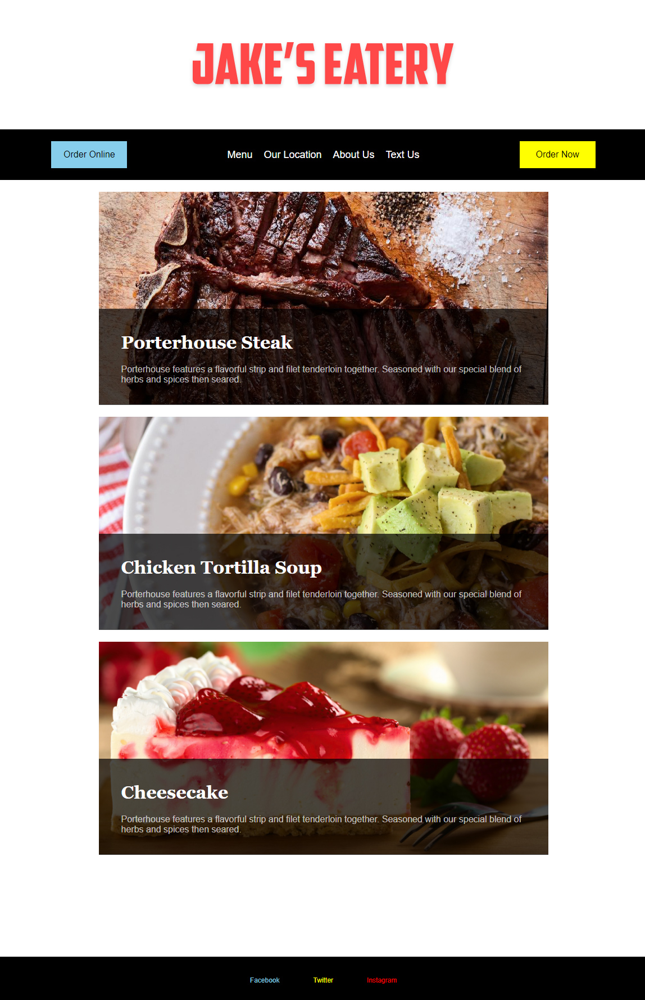

# CSS Flexbox

## Description

For this task I was tested on using CSS Flexbox, building a webpage for a client called, Jakes Eatery. This task also marked the beginning of workflow as a developer.

### User Story

To learn and experiment with CSS styles concering the functionality of `display: flex`.

### Acceptance Criteria

* To follow the task's README.md file 
* To add CSS selectors targeting specific classes
* To add colour and padding to specific div classes
* Add properties for `width`, `height`, `justify-content`, `button`, `background-image` to specific div classes
* To style the footer as illustrated in the task notes

### Deployed Website

View the deployed application for week-2, task 3, Jakes Eatery at [makemassair.github.io](https://makemassair.github.io/Jakes-Eatery/).

### Screenshot

